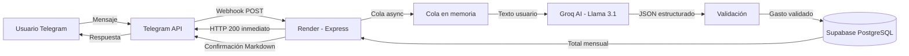

# 💰 Bot Finanzas Personales — Estado Actual

Documento de referencia para planificación de mejoras. Refleja el estado del sistema al **7 de abril de 2026**.

---

## Arquitectura General



---

## Stack Tecnológico

| Componente | Tecnología | Tier | Costo |
|---|---|---|---|
| Runtime | Node.js 24 (ESM) | — | $0 |
| Server | Express 4 | — | $0 |
| IA / Parser | Groq SDK → Llama 3.1 8B Instant | Free | $0 |
| Base de datos | Supabase PostgreSQL | Free (500 MB) | $0 |
| Hosting | Render Web Service | Free (512 MB RAM) | $0 |
| Webhook | Telegram Bot API | Free | $0 |
| Logging | Winston (console) | — | $0 |
| **Total mensual** | | | **$0** |

---

## Funcionalidades Implementadas

### 1. Registro de Gastos (Lenguaje Natural)

| Aspecto | Detalle |
|---|---|
| **Entrada** | Texto libre en español (ej: "gasté 5500 en verdulería") |
| **Procesamiento** | Groq AI en modo JSON estricto extrae monto, categoría, descripción, establecimiento |
| **Categorías** | Alimentos, Transporte, Hogar, Salud, Educación, Ocio, Ropa, Tecnología, Servicios, Facturas, Salidas, Otros |
| **Respuesta** | Confirmación con emojis + monto + categoría + total acumulado del mes |
| **Latencia típica** | ~3-4 segundos (incluye Groq + Supabase + Telegram) |

**Ejemplo de interacción:**
```
Usuario: gaste 5500 en verduleria
Bot:     ✅ Gasto registrado
         💸 Monto: $5.500
         🏷️ Categoría: Alimentos
         📝 Descripción: verduleria
         📅 Total del mes: $5.500
```

### 2. Resumen Mensual (`/resumen`)

| Aspecto | Detalle |
|---|---|
| **Datos** | Gastos del mes actual agrupados por categoría |
| **Agregación** | RPC nativa PostgreSQL (`GROUP BY + SUM`) con fallback JS |
| **Visualización** | Barras proporcionales (▓░), porcentajes, total, cantidad de registros |
| **Performance** | Query filtrada por mes — no carga datos históricos |

**Ejemplo:**
```
📊 Resumen de Abril 2026

▓▓▓▓▓▓▓▓ Alimentos: $5.500 (100.0%)

💰 Total del mes: $5.500
📝 Registros: 1
```

### 3. Comando `/start`

Mensaje de bienvenida con instrucciones de uso y ejemplos.

---

## Garantías Técnicas (ya implementadas)

| Garantía | Implementación |
|---|---|
| **Idempotencia** | UNIQUE constraint en `(telegram_user_id, telegram_message_id)`. Si Telegram reenvía un mensaje, se ignora. |
| **Respuesta rápida** | Webhook responde HTTP 200 inmediatamente. Procesamiento en cola async. |
| **Resiliencia Groq** | Si falla o rate limit (429), responde "⚠️ Problema técnico momentáneo. Reintentá en 30s." sin crashear. |
| **Resiliencia Supabase** | Si falla el insert, responde "❌ No pude guardar el registro. Reintentá." |
| **Validación IA** | JSON mode estricto + try/catch en parseo + validación de campos obligatorios (monto > 0, categoría válida). |
| **Markdown fallback** | Si Telegram rechaza el Markdown, reenvía sin formato automáticamente. |
| **Typing indicator** | `sendChatAction("typing")` antes de cada respuesta para UX. |
| **Logging estructurado** | Winston con timestamps, latencia, tokens consumidos, contexto por mensaje. |
| **Graceful shutdown** | Manejo de SIGTERM + unhandledRejection. |

---

## Modelo de Datos

```sql
CREATE TABLE gastos (
  id                  BIGSERIAL PRIMARY KEY,
  telegram_user_id    BIGINT NOT NULL,
  telegram_chat_id    BIGINT NOT NULL,
  telegram_message_id BIGINT NOT NULL,
  monto               NUMERIC(12, 2) NOT NULL CHECK (monto > 0),
  categoria           TEXT NOT NULL DEFAULT 'Otros',
  descripcion         TEXT,
  establecimiento     TEXT,
  raw_message         TEXT,        -- mensaje original del usuario
  created_at          TIMESTAMPTZ NOT NULL DEFAULT NOW(),
  CONSTRAINT uq_user_message UNIQUE (telegram_user_id, telegram_message_id)
);
```

**Índices:**
- `idx_gastos_user_date` → `(telegram_user_id, created_at DESC)`
- `idx_gastos_user_categoria` → `(telegram_user_id, categoria)`

**Función RPC:**
- `resumen_mensual(p_user_id, p_year, p_month)` → `GROUP BY categoria, SUM(monto), COUNT(*)`

**Seguridad:**
- Row Level Security habilitado
- Policy `service_role_full_access` (el bot usa service_role key)

---

## Infraestructura de Producción

| Recurso | URL / ID |
|---|---|
| **Bot Telegram** | @FinanzasPersonales_bot |
| **Render Service** | `https://bot-finanzas-7p3d.onrender.com` |
| **Webhook** | `https://bot-finanzas-7p3d.onrender.com/webhook` |
| **Health check** | `https://bot-finanzas-7p3d.onrender.com/health` |
| **Supabase Project** | `nejbepyizibuqulyzqrw` (us-west-2) |
| **GitHub Repo** | `felipevalor/bot-finanzas` |

---

## Endpoints HTTP

| Método | Ruta | Función |
|---|---|---|
| `GET` | `/` | Status JSON (uptime) |
| `GET` | `/health` | Health check para cron/monitoring |
| `POST` | `/webhook` | Recibe updates de Telegram |

---

## Limitaciones Conocidas (Free Tier)

| Limitación | Impacto | Mitigación |
|---|---|---|
| **Render spin-down** | Servicio se duerme tras 15 min inactivo. Cold start ~30-60s. | ✅ Self-ping integrado cada 13 min (`src/services/keepAlive.js`) |
| **Render 512 MB RAM** | Cola en memoria pierde mensajes si el proceso se reinicia | Volumen bajo — aceptable por ahora |
| **Groq rate limits** | Free tier: ~30 req/min | Cola secuencial previene ráfagas |
| **Supabase 500 MB** | ~500K registros de gastos estimados | Sobra para uso personal |
| **Sin multi-usuario** | Funciona con múltiples usuarios pero sin aislamiento ni auth | Aceptable para uso personal/demo |

---

## TO-DO: Pendientes Operativos

- [x] **Configurar cron keep-alive** — Implementado como self-ping integrado (`src/services/keepAlive.js`) que golpea `/health` cada 13 min en producción
- [ ] **Rotar secrets** — El Telegram token y API keys están en el historial de git (primer commit). Considerar rotarlos
- [ ] **Monitoreo** — Sin alertas activas. Si Render cae, nadie se entera hasta que un usuario reporta

---

## Estructura de Archivos

```
bot-finanzas/
├── .env                          # Variables de entorno (NO en git)
├── .gitignore
├── package.json                  # ESM, Node 20+
├── index.js                      # Express + webhook + cola async + handlers
├── debug.mjs                     # Script de diagnóstico de conexiones
├── src/
│   ├── config/
│   │   ├── env.js                # Validación de env vars + config centralizado
│   │   ├── supabase.js           # Client singleton con fetch explícito
│   │   └── groq.js               # Client singleton
│   ├── services/
│   │   ├── telegram.js           # sendTyping, sendMessage, setWebhook
│   │   ├── parser.js             # System prompt + Groq JSON mode + validación
│   │   ├── storage.js            # isDuplicate, saveExpense, getMonthlyTotal
│   │   ├── resumen.js            # RPC nativa + fallback JS + formateo Markdown
│   │   ├── expenseManager.js     # /editar, /eliminar con sesiones inline
│   │   └── keepAlive.js          # Self-ping cada 13 min para evitar Render spin-down
│   └── utils/
│       └── logger.js             # Winston estructurado
├── scripts/
│   └── init-db.sql               # Schema + índices + RPC + RLS
└── README.md                     # Setup, deploy, checklist, roadmap
```

---

## Métricas de Producción (primer mensaje)

| Métrica | Valor |
|---|---|
| Latencia Groq | 372ms |
| Tokens prompt | 232 |
| Tokens completion | 48 |
| Tokens total | 280 |
| Latencia end-to-end | 3.371s |
| Latencia `/resumen` | 2.043s |

---

## Roadmap Sugerido (para priorizar)

### 🔴 Crítico (hacer ya)
- [x] Cron keep-alive integrado (self-ping)
- [ ] Rotar API keys comprometidas en git history

### 🟡 Mejoras de Producto
- [ ] Comando `/eliminar` — borrar último gasto registrado
- [ ] Comando `/export` — generar CSV/Excel del mes
- [ ] Soporte multi-moneda (USD/ARS con tipo de cambio)
- [ ] Gastos recurrentes programados (alquiler, servicios)
- [ ] Alertas de presupuesto por categoría
- [ ] Filtro por rango de fechas en `/resumen`

### 🟢 Escalabilidad Técnica
- [ ] Migrar cola a Redis/BullMQ si escala a >100 usuarios
- [ ] Sentry o similar para error tracking
- [ ] Dashboard web con gráficos (Supabase + Chart.js)
- [ ] Rate limiting por usuario (anti-abuso)
- [ ] Tests automatizados (unit + integration)

### 🔵 Monetización (futuro)
- [ ] Plan premium con reportes avanzados
- [ ] Integración con bancos (APIs/scraping)
- [ ] Compartir gastos entre usuarios (parejas/roommates)
